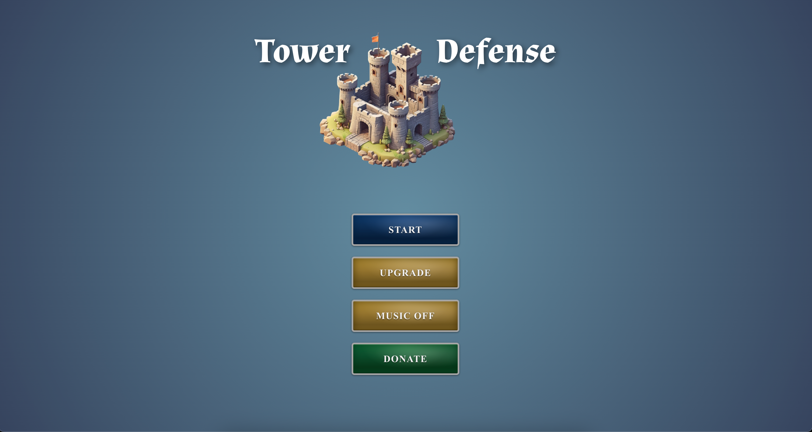

# Tower Defense - 3D Tower Defense Game



## 🎮 Overview

Tower Defense is a responsive 3D Tower Defense game built with React Three Fiber and Three.js. The game features procedural map generation, providing players with a unique layout every game from the distribution of tiles to the strategic positioning of paths.

### Key Features

- **Procedural Map Generation**: Every game has a unique layout
- **Fog of War System**: Progressively reveal the map by winning waves
- **Responsive Design**: Optimized for both desktop and mobile devices
- **Dynamic Tower System**: Place, upgrade, and strategize with different tower types
- **Wave-based Gameplay**: Defend against increasingly difficult waves of enemies

## 🛠️ Technology Stack

- **Frontend**: React 19
- **3D Rendering**: Three.js with React Three Fiber
- **State Management**: Effector
- **Physics Engine**: React Three Rapier
- **Build Tool**: Vite
- **Language**: TypeScript

## 🚀 Getting Started

### Prerequisites

- Node.js (18.x or higher)
- Yarn or npm

### Installation

```bash
# Clone the repository
git clone https://github.com/your-username/pantanopolis.git
cd pantanopolis

# Install dependencies
yarn install

# Start the development server
yarn dev
```

### Available Scripts

- `yarn dev`: Start the development server
- `yarn build`: Build the project for production
- `yarn lint`: Run ESLint for code quality
- `yarn format`: Format code with Prettier
- `yarn preview`: Preview the production build locally

## 🏗️ Project Architecture

The game is structured into several key modules:

### Components (Atomic Design Pattern)

- **Atomic**: Basic UI elements (buttons, icons, typography)
- **Molecule**: Combinations of atomic components (cards, forms, menus)
- **Organism**: Complex UI components (map, game controls, overlays)

### Game Engine

- **Tile Generation**: Procedural generation of game tiles
- **Map Generation**: Creation of strategic layouts and paths
- **Path Finding**: AI for enemy movement through the map
- **Tower Management**: Tower placement, targeting, and upgrades
- **Enemy Management**: Spawning, AI, and movement patterns
- **Wave System**: Difficulty scaling and rewards

### State Management

The game uses Effector for state management, separating concerns into:

- **Game State**: Core game mechanics and progress
- **UI State**: User interface and interaction state
- **User State**: Player data and preferences

## 🎲 Game Mechanics

### Procedural Generation

Maps are generated using procedural algorithms to ensure each game is unique. The generation process ensures that:

1. Maps are always playable with valid paths
2. Strategic opportunities are balanced
3. Difficulty scales appropriately

### Fog of War

The fog of war feature works as follows:
- The map starts partially obscured
- When the player wins a wave, they can reveal one more tile
- This continues until the entire map is discovered
- Strategic planning is required as players decide which tiles to reveal

### Tower Defense Gameplay

- Place towers on strategic locations to defend against waves of enemies
- Manage resources earned from defeating enemies
- Upgrade towers to increase their effectiveness
- Adapt strategy based on the procedurally generated map layout

## 🔮 Future Development

- Online multiplayer modes
- Additional tower types and enemy varieties
- Campaign mode with progressive challenges
- Custom map editor

## 📝 License

This project is licensed under the MIT License - see the LICENSE file for details.

## 👥 Acknowledgments

- Three.js community for 3D rendering support
- React Three Fiber team for the React integration
- All contributors and testers who helped shape the game
